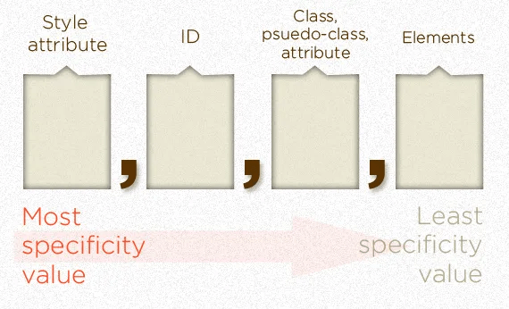
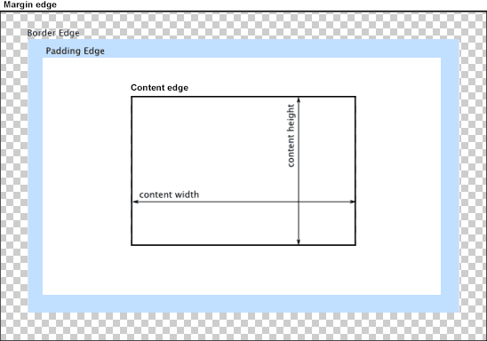

# Complete Intro to Web Development, v2

Brian Holt

- [Course link](https://frontendmasters.com/courses/web-development-v2/)
- [Resources](https://btholt.github.io/intro-to-web-dev-v2/)

## Code Sandboxes

- [CodePen](https://codepen.io/)
- [CodeSandbox](https://codesandbox.io/)
- [JSFiddle](https://jsfiddle.net/)

## Trusted Resources

- [MDN Web Docs](https://developer.mozilla.org/es/)
- [CSS-Tricks](https://css-tricks.com/)
- [Front end Handbook](https://frontendmasters.com/books/front-end-handbook/2019/)

## HTML - HyperText Markup Language

### ID's

- Ideally, ids should be unique across all the web site
- Ids are useful for linking (Adding the to the URL #id)

### Naming

With classes you want to name things _semantically_. Name things for what they are and do, not for what they look like

- camelCase (lowerCamelCase)
- PascalCase (UpperCamelCase)
- snake_case
- kebab-case

By convention, CSS is always done as kebab case. HTML isn't case sensitive, everything is lower case at the end.

### Meta HTML

```html
<!DOCTYPE html>
<html lang="en">
  <head>
    <title>My amazing HTML Document</title>
  </head>
  <body>
    <h1>Check this out</h1>
    <!-- Your amazing HTML here -->
  </body>
</html>
```

- `<!DOCTYPE html>` - The way we tell the browser that's reading the HTML what version of HTML we're using is this first tag
- `<html lang="en"></html>` - Everything (besides the doctype) goes into your html tag.
- `<head></head>` - Inside of head goes all of the meta-data to help the browser understand how to read your document. What goes inside of `title` is what will the name of the tab of the browser.
- `<body></body>` - All of our "visual" HTML will go in here.
- `<script></script>`, `<style></style>`, and `<link />`
- `<meta>` - [The metadata element](https://developer.mozilla.org/en-US/docs/Web/HTML/Element/meta#attr-name)

## CSS - Cascading Style Sheets

[The Lengths of CSS](https://css-tricks.com/the-lengths-of-css/)

### Add fonts to your project

[Web Fonts](https://fonts.google.com/)

### The Cascade

- The one that comes last wins.
- Each of the "conflicts" is resolved on a property-by-property basis

### Specificity

[Specifics on CSS Specificity](https://css-tricks.com/specifics-on-css-specificity/)


****

In otherwords:

- If the element has inline styling, that automatically1 wins (1,0,0,0 points)
- For each ID value, apply 0,1,0,0 points
- For each class value (or pseudo-class or attribute selector), apply 0,0,1,0 points
- For each element reference, apply 0,0,0,1 point

### Pseudo-classes

[Meet the Pseudo Class Selectors](https://css-tricks.com/pseudo-class-selectors/)

```css
.hover-example:hover {
    background-color: crimson;
    width: 150px;
    height: 150px;
  }
```

### Pseudo-elements

[::before / ::after](https://css-tricks.com/almanac/selectors/a/after-and-before/)

Every browser that supports the double colon (::) CSS3 syntax also supports just the (:) syntax, but IE 8 only supports the single-colon

### Box Model

#### Display

- **inline:** it makes whatever the tag is behave like text. If you I want to style some text inline, this is how to do. The key here is **the browser will determine all the height, width, padding, margins, etc. for you and will not let you change it.** If you have something and you're trying to set the width or height and it's not respecting it, it's probably the wrong display type.
- **block:** This give you control over the height, width, padding, margins, etc. of something. By default, something that is block takes the whole line to itself.
- **inline-block:** This will make browser try to place the tag inline, but will still allow you to control the height, width, padding, and margins
- **flex:** Similar to block in that it affects the tags around it like block does, however it gains some new super power on how its interior tags are layed out.
- **grid and inline-grid:** More advance display mode that allow you more power to layout tags inside of them.
- **table:** Make something act like a table. In general, use the `<table></table>` tag instead of using CSS to make things act like tables.

#### Height, Width, Padding, Border, and Margin



- **box-sizing:**
  - **content-box:** gives you the default CSS box-sizing behavior
  - **border-box:** tells the browser to account for any border and padding in the values you specify for an element's width and height.

#### Float

Places an element on the left or right side of its container, allowing text and inline elements to wrap around it.

You'll tell an element to push itself as far left or right as possible, and once it's out of space, go to the next line.

#### Flex

It allows you to to change the layout inside the tag. It allows you to **change the layout of its children.** Externally, it acts just like **block**. Likewise there is a **inline-flex** which acts just like display: inline-block externally.

##### Properties for the Parent

- `display`
- `flex-direction`: This establishes the main-axis (default row)
- `flex-wrap`: By default, flex items will all try to fit onto one line
- `flex-flow`: Shorthand for the `flex-direction` and `flex-wrap` properties
- `justify-content`: Defines the alignment along the main axis
- `align-items`: Defines the default behavior for how flex items are laid out along the cross axis on the current line
- `align-content`: This aligns a **flex container’s lines** within when there is extra space in the cross-axis. **Only takes effect on multi-line flexible containers, where flex-flow is set to either wrap or wrap-reverse)**

##### Properties for the Children

- `order`: controls the order in which they (flex items) appear in the flex container
- `flex-grow`: Defines the ability for a flex item to grow if necessary
- `flex-shrink`: Defines the ability for a flex item to shrink if necessary
- `flex-basis`: Defines the default size of an element before the remaining space is distributed
- `flex`: Shorthand for flex-grow, flex-shrink and flex-basis combined
- `align-self`: Allows the default alignment (or the one specified by align-items) to be overridden for individual flex items

Taken from: [A Complete Guide to Flexbox](https://css-tricks.com/snippets/css/a-guide-to-flexbox/)

[FLEXBOX FROGGY](https://flexboxfroggy.com/)
[FLEXBOX ZOMBIES](https://mastery.games/flexboxzombies/)

# Javascript

## Event Bubbling

When an event happens on an element, it first runs the handlers on it, then on its parent, then all the way up on other ancestors

[Bubbling and capturing](https://javascript.info/bubbling-and-capturing)
